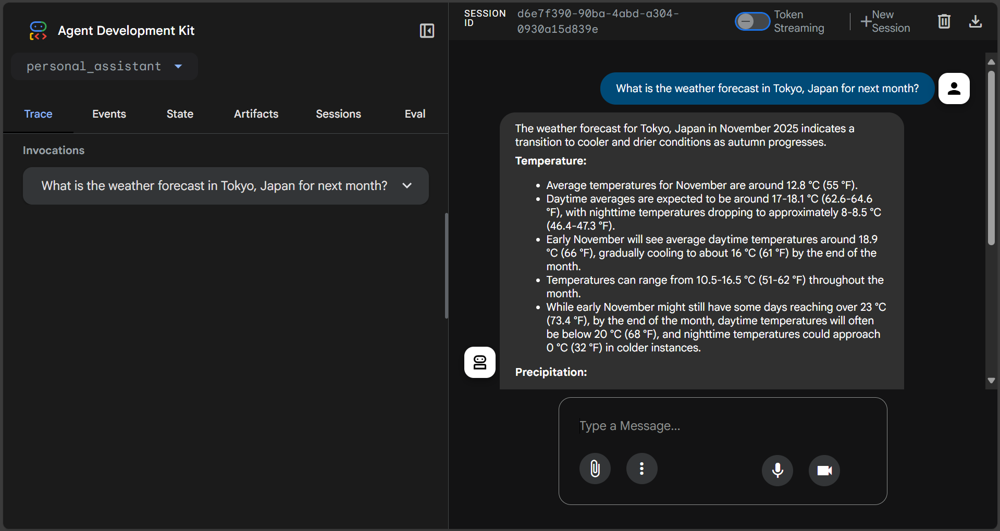
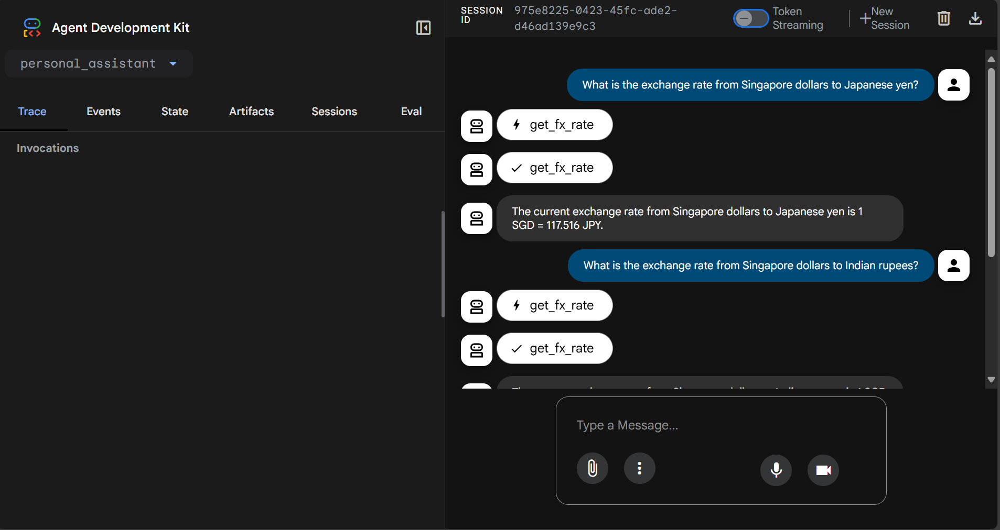
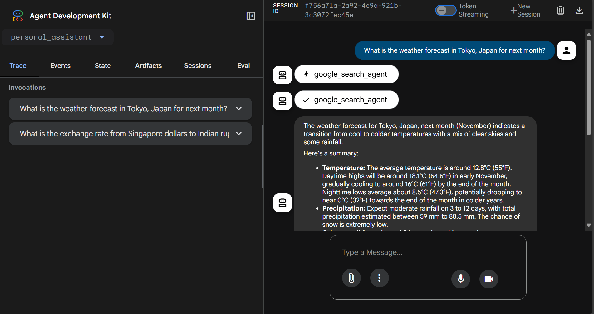
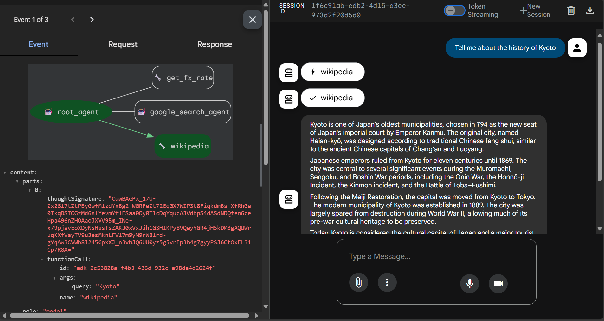

# Building AI Agents with ADK: Empowering with Tools

This project demonstrates a modular AI system using **Google’s Agent Development Kit (ADK)**.  
The AI agent can answer real-time questions by integrating:

✅ Currency Exchange API (Custom Function Tool)  
✅ Google Search (Built-in Tool)  
✅ LangChain Wikipedia Tool (Third-party Integration)  
✅ Multi-Agent Collaboration  
✅ ADK Web UI Debugging & Tracing  

---

## 📽️ Demo Video

🎥 Watch Demo: **[Add your video link here]**

---

## 📸 Project Screenshots

| ADK Web UI | Currency Exchange Tool |
|------------|------------------------|
|  |  |

| Google Search Agent | Wikipedia Tool |
|---------------------|----------------|
|  |  |

> Place your screenshots under `/screenshots` and update the file names accordingly.

---

## 🗂️ Project Structure

ai-agents-adk/
│
├── personal_assistant/
│ ├── .env
│ ├── init.py
│ ├── agent.py
│ ├── custom_functions.py
│ ├── custom_agents.py
│ ├── third_party_tools.py
│
├── screenshots/
│
├── requirements.txt
└── README.md

---

## ✅ Features
✅ Multi-Agent System  
✅ Real-time Currency Conversion  
✅ Live Google Search Integration  
✅ Wikipedia Knowledge Lookup  
✅ Extensible Tool Architecture  
✅ ADK Web UI Support  

---
