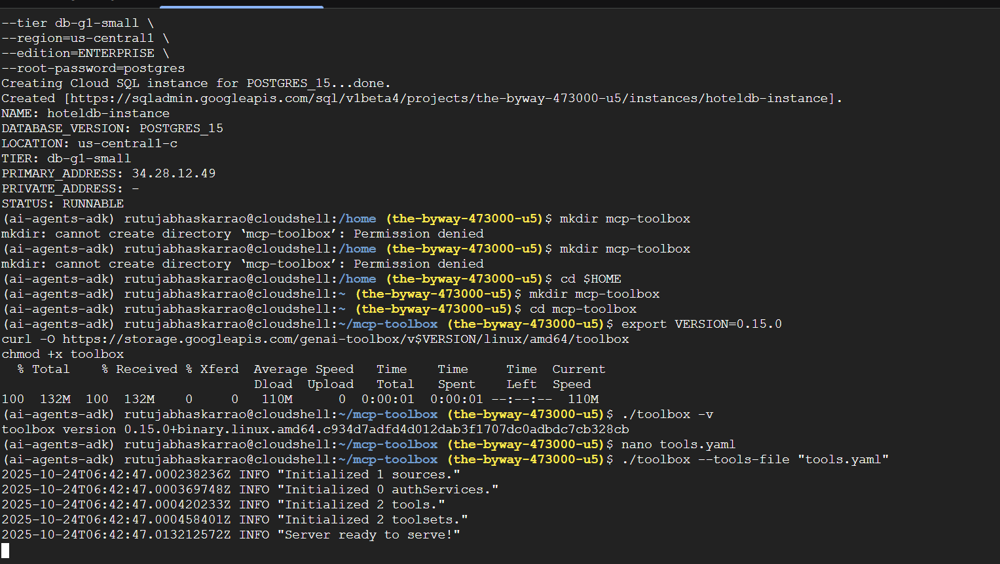
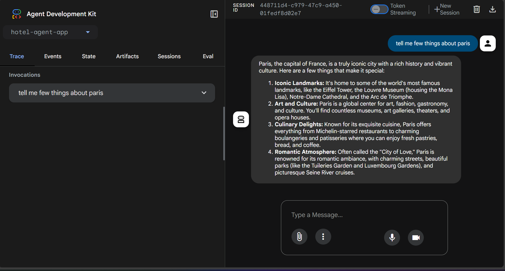
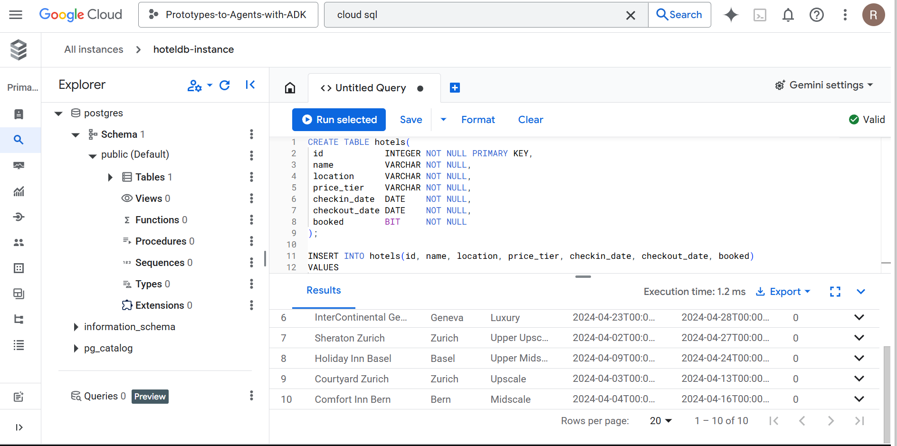
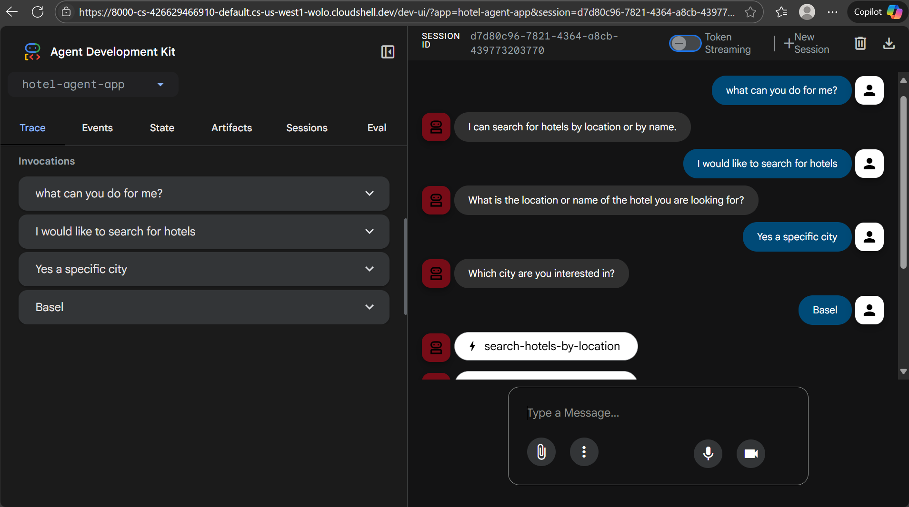
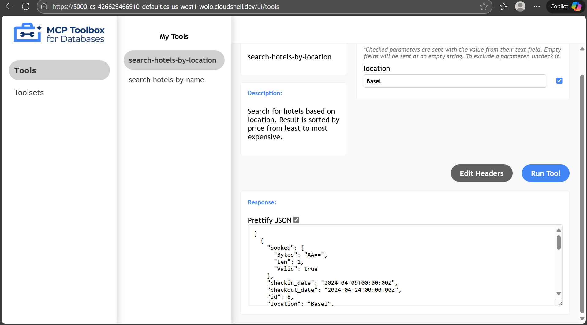
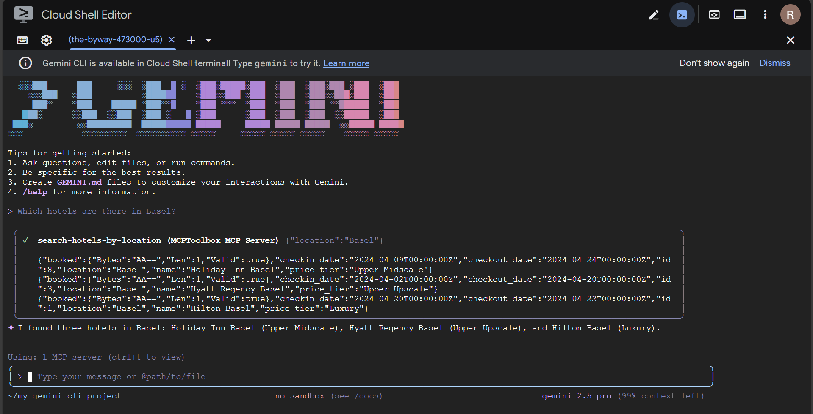
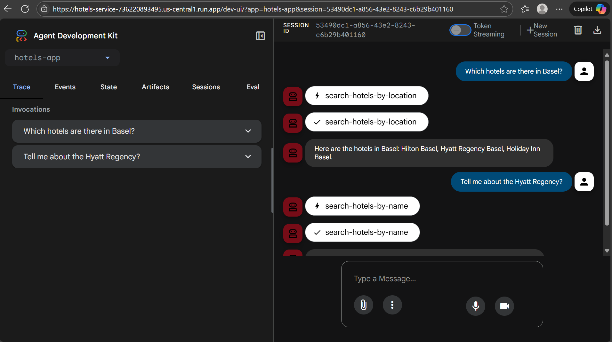

# 🧭 Travel Agent with MCP Toolbox + Google ADK (Gemini)

> An AI Travel Agent that answers hotel queries from a **real PostgreSQL database** using **MCP Toolbox** tools and the **Google Agent Development Kit (ADK)**, deployed on **Cloud Run** with a built-in chat UI.

---

## 🎥 Demo Video

**YouTube:** https://youtu.be/m-kIaIfKcL0

---

---

## 📸 Screenshots

> Put your images in `docs/screenshots/` and keep the filenames below, or update the paths.

| Screen | Image |
|---|---|
| Server |  |
| Agent with Agent Development Kit |  |
| Cloud SQL instance |  |
| Connecting our Agent to Tools |  |
| MCP Tool |  |
| Integrating MCP Toolbox in Gemini CLI.png |  |
| Hotel Agent App on Cloud Run|  |

---

## 🧱 Architecture

- **Cloud SQL (PostgreSQL):** Stores hotel data.
- **MCP Toolbox:** Exposes safe SQL queries as **tools** the model can call.
- **Gemini + ADK:** Orchestrates reasoning and tool use.
- **Cloud Run:** Serverless hosting for the agent and (optionally) the toolbox server.
- **Dev UI:** Web chat interface for testing and demos.

---

## ✅ Features

- Search hotels by **name** and **location**
- Real answers from **live SQL** (no hallucinations)
- Safe tool use via **MCP**
- Works locally and on **Cloud Run**
- Clean **Dev UI** for demos & debugging

---

## 🗂️ Repository Layout (suggested)

.
├── personal_assistant/ # or hotels-app/, your ADK app folder

│ ├── agent.py

│ ├── init.py

│ ├── .env # app-specific environment variables

│ └── requirements.txt # if you pin extras

├── mcp-toolbox/

│ ├── tools.yaml # MCP tools config (Postgres)
│
├──screenshots

├── README.md 

---

## 🔧 Prerequisites

- **Python 3.12+**
- **gcloud** CLI authenticated to your GCP project
- **Cloud SQL (PostgreSQL)** instance (with `hotels` table + seed data)
- **Cloud Run** enabled (for deploying the agent)
- **MCP Toolbox** installed (or containerized server)
- **Gemini access** via Vertex AI (same project/region as agent)

---
