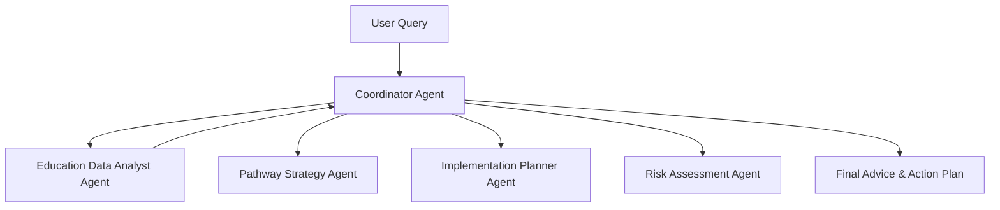

# 🎓 Education Path Advisor 

The **Education Path Advisor** is an AI-powered intelligent agent system built using **Google Agent Development Kit (ADK)** and **Model Context Protocol (MCP) Toolbox**. It helps **Indian students and parents** explore **personalized education pathways, career options, entrance exams, college admissions, and backup planning strategies**.

---

## ✅ Key Features

- 🎯 Personalized academic & career guidance for Indian students  
- 🏫 Covers exams like **JEE, NEET, UPSC, CUET, GATE, State CETs, CLAT** etc.  
- 📚 Multi-Agent system with **Data Analyst, Pathway Planner, Implementation Strategist, Risk Analyst**  
- 🔁 Structured **step-by-step actionable learning plans**  
- 🛡️ **Risk analysis & backup options** tailored to Indian realities  
- 🌍 Considers **reservation categories, state quotas, budgets & language preferences**  
- ☁️ Fully deployable using **Google Cloud Run**  
- 🧠 Powered by **Google Gemini AI via ADK**

---

## 🛠️ Tech Stack

| Component | Technology |
|-----------|------------|
| AI Model | Gemini (via Google ADK) |
| Framework | Agent Development Kit (ADK) |
| Tools | MCP Toolbox |
| Language | Python 3.12 |
| UI | ADK Web UI |
| Deployment | Google Cloud Run |
| Config | `.env` |

---

## 📌 Architecture

### 🔹 High-Level Agent Workflow



---
## 🚀 Setup & Installation

### 1) Clone Repository
```bash
git clone https://github.com/awesome-adk-agents/education-path-advisor.git
cd education-path-advisor
```

### 2) Install Dependencies
```bash
poetry install
```

### 3) Configure Environment
```bash
cat > .env << 'EOF'
GOOGLE_API_KEY=your_api_key_here
GOOGLE_GENAI_USE_VERTEXAI=FALSE
EOF
```

### 4) Run with Web Interface (ADK Web UI)

```bash
poetry run adk web
```

## 🎥 Video Link

-   **Project Walkthrough Demo Video:** [https://youtu.be/YOMeqQ3cTF0]
---

## 📂 Project Structure

📦 education-path-advisor

 ┣ 📂 education_advisor
 
 ┃ ┣ agent.py
 
 ┃ ┣ prompt.py
 
 ┃ ┗ sub_agents/
 
 ┣ 📂 eval
 
 ┣ 📂 tests
 
 ┣ pyproject.toml
 
 ┗ .env.example

